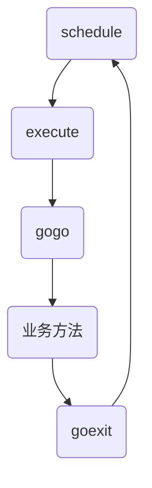

# 协程

go的协程是`runtime/runtime2.go`中g这个结构体，其中stack记录了栈的上下界限，sched（gobuf）记录栈运行的现场，atomicstatus记录协程的状态。

```go
//runtime/runtime2.go

type g struct {
	stack       stack   // offset known to runtime/cgo
	stackguard0 uintptr // offset known to liblink
	stackguard1 uintptr // offset known to liblink

	_panic    *_panic // innermost panic - offset known to liblink
	_defer    *_defer // innermost defer
	m         *m      // current m; offset known to arm liblink
	sched     gobuf
	syscallsp uintptr // if status==Gsyscall, syscallsp = sched.sp to use during gc
	syscallpc uintptr // if status==Gsyscall, syscallpc = sched.pc to use during gc
	stktopsp  uintptr // expected sp at top of stack, to check in traceback
	param        unsafe.Pointer
	atomicstatus atomic.Uint32  //协程的状态
	stackLock    uint32 // sigprof/scang lock; TODO: fold in to atomicstatus
	goid         uint64         //协程的ID号
	schedlink    guintptr
	waitsince    int64      // approx time when the g become blocked
	waitreason   waitReason // if status==Gwaiting
	preempt       bool // preemption signal, duplicates stackguard0 = stackpreempt
	preemptStop   bool // transition to _Gpreempted on preemption; otherwise, just deschedule
	preemptShrink bool // shrink stack at synchronous safe point
	asyncSafePoint bool
	paniconfault bool // panic (instead of crash) on unexpected fault address
	gcscandone   bool // g has scanned stack; protected by _Gscan bit in status
	throwsplit   bool // must not split stack
	activeStackChans bool
	parkingOnChan atomic.Bool

	raceignore    int8  // ignore race detection events
	tracking      bool  // whether we're tracking this G for sched latency statistics
	trackingSeq   uint8 // used to decide whether to track this G
	trackingStamp int64 // timestamp of when the G last started being tracked
	runnableTime  int64 // the amount of time spent runnable, cleared when running, only used when tracking
	lockedm       muintptr
	sig           uint32
	writebuf      []byte
	sigcode0      uintptr
	sigcode1      uintptr
	sigpc         uintptr
	parentGoid    uint64          // goid of goroutine that created this goroutine
	gopc          uintptr         // pc of go statement that created this goroutine
	ancestors     *[]ancestorInfo // ancestor information goroutine(s) that created this goroutine (only used if debug.tracebackancestors)
	startpc       uintptr         // pc of goroutine function
	racectx       uintptr
	waiting       *sudog         // sudog structures this g is waiting on (that have a valid elem ptr); in lock order
	cgoCtxt       []uintptr      // cgo traceback context
	labels        unsafe.Pointer // profiler labels
	timer         *timer         // cached timer for time.Sleep
	selectDone    atomic.Uint32  // are we participating in a select and did someone win the race?

	goroutineProfiled goroutineProfileStateHolder

	trace gTraceState
	gcAssistBytes int64
}


// Stack describes a Go execution stack.
// The bounds of the stack are exactly [lo, hi), 栈的界限
// with no implicit data structures on either side.
type stack struct {  
    lo uintptr  //栈的低地址
    hi uintptr  //栈的高地址
}


type gobuf struct {
    sp   uintptr    //stack point 栈
    pc   uintptr    //Program Counter 程序计数器 程序运行的位置
    g    guintptr
    ctxt unsafe.Pointer
    ret  uintptr
    lr   uintptr
    bp   uintptr // for framepointer-enabled architectures
}

```

协程g的结构体的基本结构


计算机线程在go中的表示，是runtime/runtime2.go中的m结构体。

```go
type m struct {
	g0      *g     // goroutine with scheduling stack 具有调度栈的Goroutine
	morebuf gobuf  // gobuf arg to morestack
	divmod  uint32 // div/mod denominator for arm - known to liblink
	_       uint32 // align next field to 8 bytes

	// Fields not known to debuggers.
	procid        uint64            // for debuggers, but offset not hard-coded
	gsignal       *g                // signal-handling g
	goSigStack    gsignalStack      // Go-allocated signal handling stack
	sigmask       sigset            // storage for saved signal mask
	tls           [tlsSlots]uintptr // thread-local storage (for x86 extern register)
	mstartfn      func()
	curg          *g       // current running goroutine 当前运行goroutine
	caughtsig     guintptr // goroutine running during fatal signal
	p             puintptr // attached p for executing go code (nil if not executing go code)
	nextp         puintptr
	oldp          puintptr // the p that was attached before executing a syscall
	id            int64
	mallocing     int32
	throwing      throwType
	preemptoff    string // if != "", keep curg running on this m
	locks         int32
	dying         int32
	profilehz     int32
	spinning      bool // m is out of work and is actively looking for work
	blocked       bool // m is blocked on a note
	newSigstack   bool // minit on C thread called sigaltstack
	printlock     int8
	incgo         bool          // m is executing a cgo call
	isextra       bool          // m is an extra m
	isExtraInC    bool          // m is an extra m that is not executing Go code
	freeWait      atomic.Uint32 // Whether it is safe to free g0 and delete m (one of freeMRef, freeMStack, freeMWait)
	fastrand      uint64
	needextram    bool
	traceback     uint8
	ncgocall      uint64        // number of cgo calls in total
	ncgo          int32         // number of cgo calls currently in progress
	cgoCallersUse atomic.Uint32 // if non-zero, cgoCallers in use temporarily
	cgoCallers    *cgoCallers   // cgo traceback if crashing in cgo call
	park          note
	alllink       *m // on allm
	schedlink     muintptr
	lockedg       guintptr
	createstack   [32]uintptr // stack that created this thread.
	lockedExt     uint32      // tracking for external LockOSThread
	lockedInt     uint32      // tracking for internal lockOSThread
	nextwaitm     muintptr    // next m waiting for lock

	// wait* are used to carry arguments from gopark into park_m, because
	// there's no stack to put them on. That is their sole purpose.
	waitunlockf          func(*g, unsafe.Pointer) bool
	waitlock             unsafe.Pointer
	waitTraceBlockReason traceBlockReason
	waitTraceSkip        int

	syscalltick uint32
	freelink    *m // on sched.freem
	trace       mTraceState

	// these are here because they are too large to be on the stack
	// of low-level NOSPLIT functions.
	libcall   libcall
	libcallpc uintptr // for cpu profiler
	libcallsp uintptr
	libcallg  guintptr
	syscall   libcall // stores syscall parameters on windows

	vdsoSP uintptr // SP for traceback while in VDSO call (0 if not in call)
	vdsoPC uintptr // PC for traceback while in VDSO call

	// preemptGen counts the number of completed preemption
	// signals. This is used to detect when a preemption is
	// requested, but fails.
	preemptGen atomic.Uint32

	// Whether this is a pending preemption signal on this M.
	signalPending atomic.Uint32

	dlogPerM

	mOS     //每个操作系统特有的一些信息

	// Up to 10 locks held by this m, maintained by the lock ranking code.
	locksHeldLen int
	locksHeld    [10]heldLockInfo
}
```

线程执行过程



runtime.proc.go  schedule() --> execute(gp, inheritTime) -->gogo(&gp.sched)

schedule() 中定义了一个gp，用来存储将要执行的协程，

找到协程以后调用execute，传入找到的协程。

execute中初始化一些协程栈信息以后，又调用了gogo函数。

gogo是汇编实现的函数，可以再asm_amd64.s中看到runtime·gogo

拿到要执行的g,在正式执行业务函数之前，先人工在g的栈中插入一个栈帧，也就是goexit()，然后跳转到要执行的g中程序计数器的位置继续执行

开始进入普通协程g中执行代码，当业务执行完成，执行栈底的goexit()函数。

goexit 也是一个汇编函数,在asm_amd64.s中runtime·goexit这个函数，函数中又调用了runtime/proc.go中的goexit1()这个函数

goexit1()中执行了mcall(goexit0)，这个函数会切换到g0协程执行goexit0函数

goexit0中会继续调用schedule()这个函数

## GMP

p

```go
type p struct{
	m muintptr //线程
	runqhead uint32
	runqtail uint32
	runq [256]guintptr
	runnext  guintptr//下一个可执行
}
```
每切换61次协程，会从全局协程中获取协程，防止全局饥饿。

### 协程怎么切换

- 主动挂起
- 系统调用完成

#### 主动挂起

runtime.gopark()

gopark保护现场，业务协程等待，利用mcall函数切换g0协程，调用schedule()，重新开始协程的调度。

gopark()函数没有导出，不能直接调用，但是在某些时候可以间接调用，例如time.Sleep()

#### 系统调用完成

在发起系统调用结束时，会调用exitsyscall()函数，会调用Gosched()函数，函数中调用mcall(gosched_m)，调用goschedImpl()，调用schedule()

#### runtime.morestack()，基于协作的抢占式调度

一个协程执行超过10ms，那么把抢占标记标记为抢占

之后如果协程调用了runtime.morestack()函数的时候，会检查抢占标记是否被标记，如果被标记会调用goschedImpl()，最终调用schedule()

#### 基于信号的抢占式调度

信号是指，操作系统中，基于信号的通信方式

线程可以注册对应信号的处理函数，go中使用的是SIGURG信号，go中注册了SIGURG信号处理函数doSigPreempt()

GC工作时，想目标线程发送SIGURG信号。

现成收到信号的时候，处理doSigPreempt()函数，最终调用schedule()函数，重新调度协程。

## 协程优化

### 协程太多的问题

协程太多的时候panic too many concurrent operations on a single file or socket 

可能产生问题的原因

- 文件打开数限制
- 内存限制
- 调度开销太大

解决协程多的问题

- 优化业务逻辑
- 利用channel的缓冲区
- 协程池
- 调整系统资源

**优化业务逻辑**


